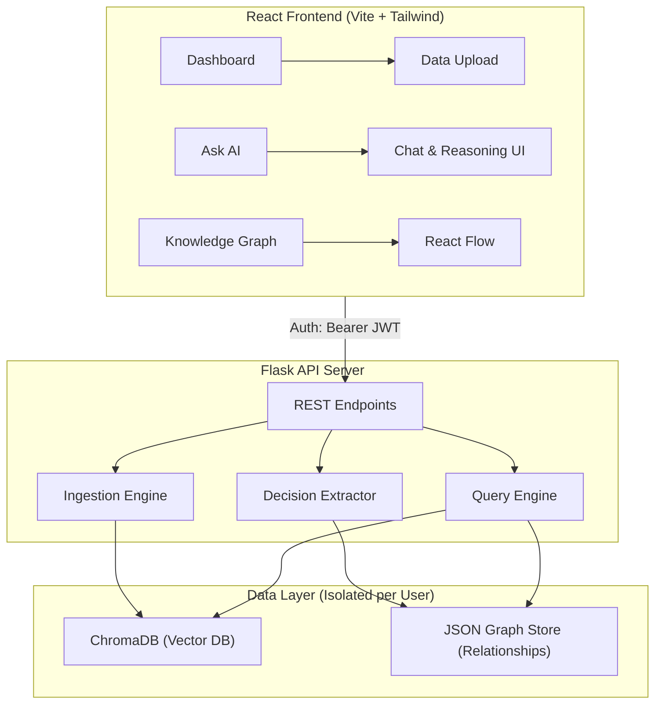

# 🧠 OrgMemory — Organizational Memory & Reasoning Engine

> **Never lose the "Why" behind a decision again.**  
> OrgMemory is an AI-powered platform that acts as a company’s memory and reasoning layer. It ingests unstructured communication data (Slack, emails, meeting notes), extracts decisions and the exact reasoning behind them, and allows users to query their organization's history in natural language with **full explainability**.

## 🌟 Core Features

- **Multi-Format Data Ingestion**: Securely drag & drop Slack JSON exports, Email `.txt` threads, generated PDFs, and meeting notes.
- **Pattern-Based Decision Extraction**: Automatically pulls out what decision was made, who was involved, what alternatives were rejected, and the specific reasoning context.
- **Explainable AI (Hybrid Querying)**: Uses a powerful combination of a **Vector Database (ChromaDB)** for semantic search and a **Graph Store** for definitive relationship mapping. Answers don't just guess—they prove exactly *why*.
- **Interactive Knowledge Graph**: Visualize how people, topics, decisions, and rejected alternatives relate to each other through a dynamic React Flow graph interface.
- **Secure & Multi-Tenant**: Built-in authentication (JWT + bcrypt). Every user gets an isolated vector namespace and graph network to ensure strict data privacy.
- **Premium UI/UX**: Built with React and Tailwind CSS v4, featuring a modern glassmorphism aesthetic, dark mode tokens, and smooth micro-animations.

---

## 🏗️ Architecture



---

## 💻 Tech Stack

### Frontend
- **Framework**: React 18 + Vite
- **Styling**: Tailwind CSS v4 (Custom UI, Glassmorphism)
- **Routing**: React Router v6
- **Visualization**: React Flow v11 (Knowledge Graph)
- **Icons**: Lucide React
- **API Client**: Axios (with JWT interceptors)

### Backend
- **Framework**: Python / Flask
- **Authentication**: PyJWT, bcrypt
- **Vector Database**: ChromaDB (for semantic similarity/embeddings)
- **Graph Database**: Custom JSON-based localized graph store
- **Parsers**: PyPDF2, custom JSON/TXT handlers

---

## 🚀 Local Setup Instructions

### Prerequisites
- Node.js (v18+)
- Python (3.8+)
- Git

### 1. Clone the Repository
```bash
git clone https://github.com/2403031560033-art/SunHacks_P4.git
cd SunHacks_P4
```

### 2. Start the Backend (API & AI Layer)
Open a terminal and run the automated startup script (Windows):
```cmd
cd backend
start.bat
```
*Alternatively, install manually:*
```bash
cd backend
pip install flask flask-cors chromadb==0.4.22 PyPDF2 PyJWT==2.8.0 bcrypt==4.1.3 posthog==3.3.1
python app.py
```
*(Backend runs on `http://localhost:5000`)*

### 3. Start the Frontend (UI)
Open a new, separate terminal:
```bash
cd frontend
npm install
npm run dev
```
*(Frontend runs on `http://localhost:5173`)*

---

## 📖 How to Use the App

1. **Create an Account**: Go to `http://localhost:5173`, click "Create one free", and register.
2. **Upload Data**: Go to the Dashboard and drag-and-drop the sample files located in `backend/sample_data/` (`slack_conversation.json`, `email_thread.txt`, etc.).
3. **Ask the AI**: Navigate to the "Ask AI" tab and ask questions like:
   * *"Why did we choose AWS over Azure?"*
   * *"What alternatives were considered for the API gateway?"*
   * *"Who was involved in the frontend framework decision?"*
4. **Explore the Graph**: Click on "Knowledge Graph" to see a visual layout of how people, decisions, and topics interlock based on the data you uploaded.

---

## 🏆 Why We Built It This Way (Hackathon Notes)

Standard Retrieval-Augmented Generation (RAG) often suffers from hallucination because vectors only understand *similarity*, not *connections*. 

By combining **ChromaDB** with a **Graph Database**, OrgMemory achieves strict **Explainability**. The vector search finds the relevant textual context, but the graph enforces the hard logic: "Person X was in the meeting, and Alternative Y was explicitly rejected." This multi-layered approach ensures enterprise-grade trust in the AI's answers.
